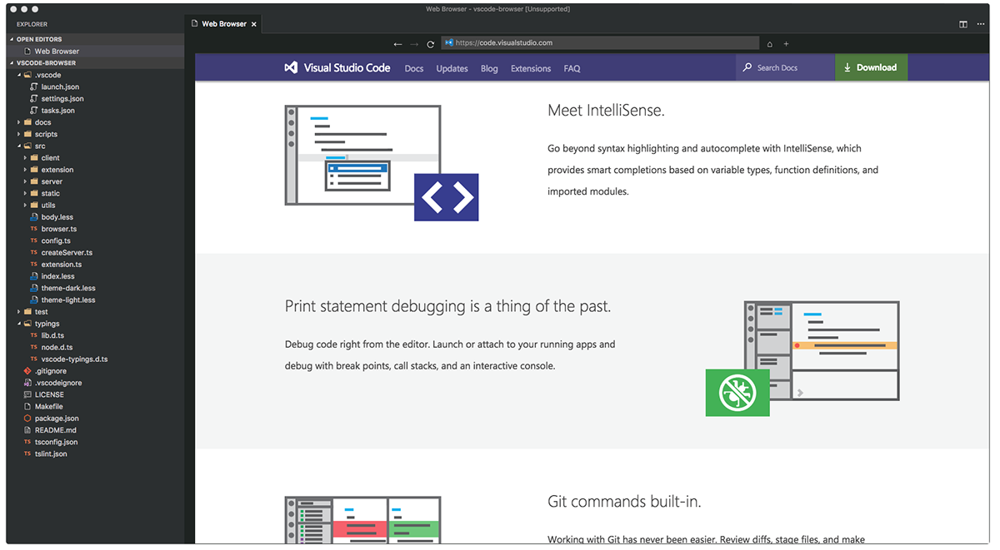

# **Chrome VS Code** <small style="color: #fff; background: #fdd400; padding: .1em .4em; font-size: 0.4em; font-weight: 600; position: relative; top: -0.7em">PREVIEW</small>

## Google Chrome for Visual Studio Code.

### First Things First

Chrome VS Code is an early version of what could potentially become a handy extension for VS Code users. As of yet, features are limited and you are *very* likely to encounter bugs. Be a dear and report them. Or fix them, PRs are very welcome.

## Key Features

✅ implemented

❎ not implemented

|	Status	 |	Feature
|------------|-
|	✅		|	Browse to http:// and https:// URLs
|	✅		|	Browse to file:// URLs
|	✅		|	Use address bar to search using your favorite search engine
|	✅		|	Open in normal and split view
|	❎		|	Cookies (this means you can't log in *anywhere*)
|	❎		|	Open selected URL
|	❎		|	Open PDFs
|	❎		|	Find in page

